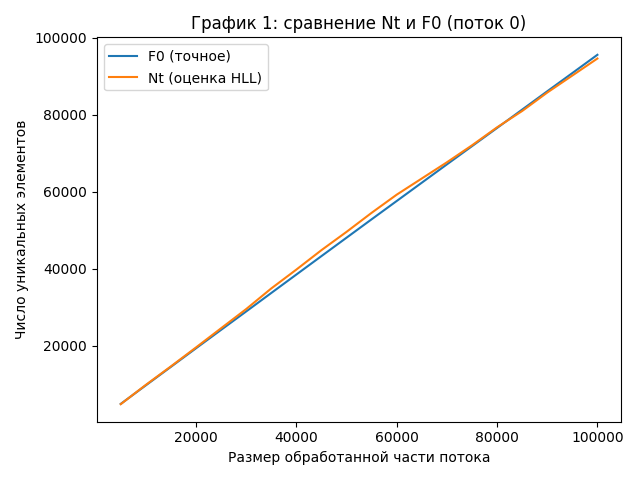
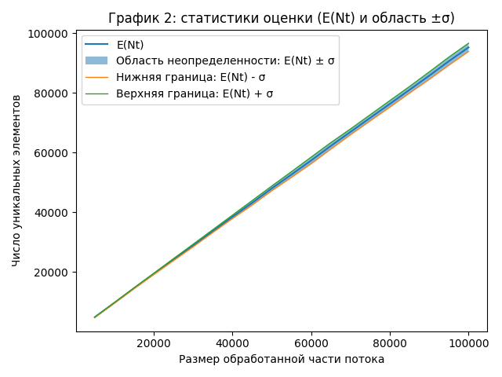

# Этап 3. Анализ результатов HyperLogLog Иванов Иван

Исходные данные:

- runs: 20
- steps: 20
- max seen: 100000

Параметры HLL (по запуску эксперимента):

- B = 12
- m = 2^B = 4096
- alpha(m) = 0.721110040

## 1) Точность и проверка теоретических отклонений

Теория (границы из задания):

- 1.04 / sqrt(2^B) = 0.01625000 (1.625%)
- 1.3 / sqrt(2^B) = 0.02031250 (2.031%)

Практика (по `stats.csv`, относительное стандартное отклонение):

- mean(σ_Nt / E(Nt)) = 0.01499698 (1.500%)
- max(σ_Nt / E(Nt)) = 0.01948026 (1.948%), при seen = 60000
- min(σ_Nt / E(Nt)) = 0.01081505 (1.082%), при seen = 15000
- условие max(σ_Nt / E(Nt)) <= 1.3 / sqrt(2^B): **true**

Практика (по `points.csv`, ошибка относительно точного F0):

- mean(|Nt - F0| / F0) = 0.01239733 (1.240%)
- p95(|Nt - F0| / F0) = 0.03014993 (3.015%)
- max(|Nt - F0| / F0) = 0.03703174 (3.703%)
- mean((Nt - F0) / F0) = -0.00187383 (-0.187%)

Смещение (по средним по шагам):

- max(|E(Nt) - E(F0)| / E(F0)) = 0.00443027 (0.443%), при seen = 90000
- значение смещения на этом seen = -0.00443027 (-0.443%)

Контрольная точка (seen = 100000):

- σ_Nt / E(Nt) = 0.01459930 (1.460%)
- (E(Nt) - E(F0)) / E(F0) = -0.00392575 (-0.393%)
- mean(|Nt - F0| / F0) = 0.01240379 (1.240%)
- max(|Nt - F0| / F0) = 0.02516243 (2.516%)

## 2) Стабильность оценки (дисперсия)

По `stats.csv`:

- min σ_Nt = 67.3654 при seen = 5000
- max σ_Nt = 1390.8200 при seen = 100000
- mean(σ_Nt / E(Nt)) = 0.01499698 (1.500%)

## 3) Влияние выбранных констант

- B определяет m = 2^B = 4096 регистров.
- Память под регистры (uint8_t) = 4096 байт (≈ 4.000 КиБ).
- Теоретическая относительная ошибка масштаба σ порядка 1 / sqrt(m). Для текущего B:
  - 1.04 / sqrt(m) = 0.01625000 (1.625%)
  - 1.3 / sqrt(m) = 0.02031250 (2.031%)

## Графики для визуализации результатов анализа точности HyperLogLog:

