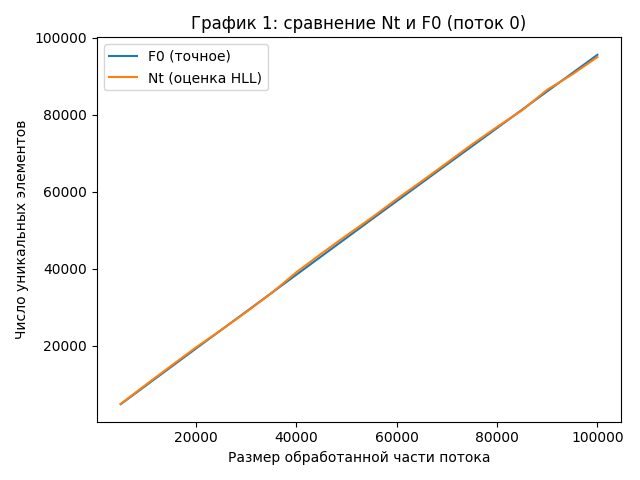
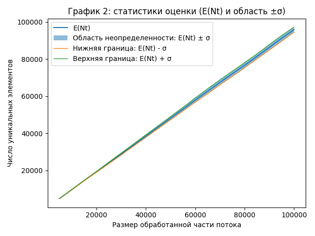

# Этап 4. Улучшенный HyperLogLog Иванов Иван

# Изменение 1: Хеш 32 бит => 64 бита

- Вместо uint32_t используем uint64_t.
- Индекс регистра берём из первых B бит хеша, а rho считаем по оставшимся 64-B битам (leading zeros + 1).
- Идея типовая для инженерных улучшений HLL (в т.ч. HyperLogLog++)

Ссылка на источник (https://static.googleusercontent.com/media/research.google.com/en/us/pubs/archive/40671.pdf)

# Изменение 2: Регистры упакованы в 6 бит

- Каждый регистр хранит значение rho, и при 64-битном хеше максимум rho = (64 - B) + 1, это помещается в 6 бит (0..63).

- Поэтому вместо std::vector<uint8_t> используем packed-хранилище по 6 бит на регистр.

- Для B=12 (m=4096): память под регистры 4096 байт → 3072 байта, экономия 25%.

- Такой формат (6-битные регистры + 64-битный хеш) широко используется на практике, например в Redis HyperLogLog.

Ссылка на источник (https://antirez.com/news/75?)

# Этап 3.2: анализ улучшенного HyperLogLog

## Данные и конфигурация

- B = 12, m = 2^B = 4096
- streamSize = 100000
- runs = 20
- stepPercent = 5 (seen от 5000 до 100000)

Теория:

- 1.04 / sqrt(2^B) = 0.01625000 = 1.6250%
- 1.3 / sqrt(2^B) = 0.02031250 = 2.0312%

## 1) Точность (Nt против F0)

По всем точкам (все run и шаги), метрика |Nt - F0| / F0:

- mean = 0.01385556 = 1.3856%
- p95 = 0.03541033 = 3.5410%
- max = 0.05903013 = 5.9030%
- доля точек с |ошибкой| ≤ 1.04/sqrt(2^B): 65.50%
- доля точек с |ошибкой| ≤ 1.3/sqrt(2^B): 76.50%

Смещение (Nt - F0) / F0:

- mean = 0.00168872 = 0.1689%
- median = -0.00088751 = -0.0888%
- max(|E(Nt)-E(F0)|/E(F0)) по seen = 0.00607533 = 0.6075% (seen = 60000)

Худшая точка по |Nt - F0| / F0:

- значение = 0.05903013 = 5.9030%
- signed = 0.05903013 = 5.9030%
- run = 15, step = 11, seen = 60000, F0 = 57657, Nt = 61060.5

Конец потока (seen = 100000):

- E(F0) = 95641.70
- E(Nt) = 95942.28
- (E(Nt)-E(F0))/E(F0) = 0.00314277 = 0.3143%
- mean(|Nt-F0|/F0) = 0.01167489 = 1.1675%
- max(|Nt-F0|/F0) = 0.04004062 = 4.0041%

## 2) Стабильность (дисперсия)

Метрика из stats.csv: σ_Nt / E(Nt)

- mean = 0.01705373 = 1.7054%
- min = 0.01122187 = 1.1222% (seen = 15000)
- max = 0.02118466 = 2.1185% (seen = 65000)
- проверка max ≤ 1.3/sqrt(2^B): false

Конец потока (seen = 100000):

- σ_Nt = 1383.89
- E(Nt) = 95942.30
- σ_Nt / E(Nt) = 0.01442419 = 1.4424%

## 3) Эффективность констант и влияние улучшений

- B = 12 => m = 4096 регистров, целевой масштаб относительной ошибки порядка 1/sqrt(m) ≈ 1.5625%
- Память под регистры:
  - стандарт (uint8 на регистр): 4096 байт
  - packed 6 бит: 3072 байт
  - экономия: 1024 байт (25.0%)
- 64-битный хеш: увеличивает “запас” бит для индекса и rho (меньше риск артефактов распределения по регистрами).

## Графики для визуализации результатов анализа точности улучшенного HyperLogLog:

